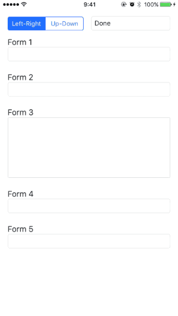
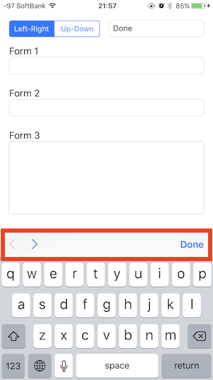
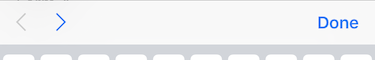
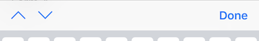
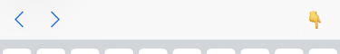
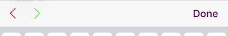

# FormToolbar
Simple, movable and powerful toolbar for UITextField and UITextView.

[](https://github.com/sgr-ksmt/FormToolbar/releases)

[](https://github.com/Carthage/Carthage)
[](https://cocoapods.org)

|       Sample GIF        |        Capture        |
|:-----------------------:|:---------------------:|
|  |  |

- [Appetize.io's Demo is here!](https://appetize.io/embed/w7muzzpbfr2p5fw1juctnp9qn0?device=iphone7&scale=100&orientation=portrait&osVersion=10.2)

## Feature
- Easy to use. (Just add inputs to toolbar).
- available to use `UITextField` and `UITextView`. (mix ok!!)

## Usage
### Getting Started

- ViewController has two text fields and one text view.

```swift
class ViewController: UIViewController {
    @IBOutlet private weak var emailTextField: UITextField!
    @IBOutlet private weak var passwordTextField: UITextField!
    @IBOutlet private weak var profileTextView: UITextView!
}
```

- Create Toolbar (and attach toolbar to textfield's inputAccessoryView)

```swift
    self.toolbar = FormToolbar(inputs: [emailTextField, passwordTextField, profileTextView])
```

- Call *update()* on UITextField's delegate method. (or UItextView's delegate method.)

```swift
func textFieldDidBeginEditing(_ textField: UITextField) {
    toolbar.updater()
}
```

- "Is that all?" - ***Yeah, that is all.*** :thumbsup:

**NOTE:** There is demo project!!

### Advanced
- Back/Forward button type

```swift
toolbar.direction = .leftRight
toolbar.direction = .upDown
```

*Left-Right*  
  
<br />
*Up-Down*  


- "Done" button's title

```swift
toolbar.doneButtonTitle = "👇"
```




- Change button color

```swift
toolbar.backButtonTintColor = .red
toolbar.forwardButtonTintColor = .green
toolbar.doneButtonTintColor = .purple

// or set all together
toolbar.setButtonsTintColor(.red)
```




- Get current/previous/next input

```swift
toolbar.currentInput
toolbar.previousInput
toolbar.nextInput

if let activeTextField = toolbar.currentInput as? UITextField {
    // ...
}
```

- Update Inputs

```swift
let newInputs: [FormInput] = [emailTextField, passwordTextField]
toolbar.set(inputs: newInputs)
```

- Go forward when UITextField's return key pressed

```swift
func textFieldShouldReturn(_ textField: UITextField) -> Bool {
    toolbar.goForward()
    return true
}
```


## Requirements
- iOS 9.0+
- Xcode 8.2.1+
- Swift 3.0+

## Installation

### Carthage

- Add the following to your *Cartfile*:

```bash
github "sgr-ksmt/FormToolbar" ~> 1.0
```

- Run `carthage update`
- Add the framework as described.
<br> Details: [Carthage Readme](https://github.com/Carthage/Carthage#adding-frameworks-to-an-application)


### CocoaPods

**FormToolbar** is available through [CocoaPods](http://cocoapods.org). To install
it, simply add the following line to your Podfile:

```ruby
pod 'FormToolbar', '~> 1.0'
```

and run `pod install`

### Manually Install
Download all `*.swift` files and put your project.

## Change log
Change log is [here](https://github.com/sgr-ksmt/FormToolbar/blob/master/CHANGELOG.md).

## Communication
- If you found a bug, open an issue.
- If you have a feature request, open an issue.
- If you want to contribute, submit a pull request.:muscle:

## License

**FormToolbar** is under MIT license. See the [LICENSE](LICENSE) file for more info.
